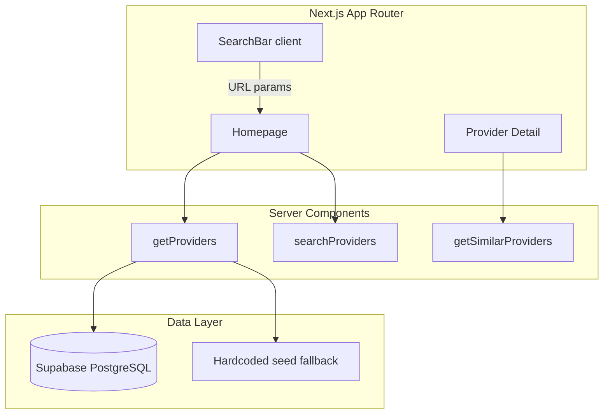

# MediGo — Case Study

A two-sided medical tourism marketplace built as a portfolio project demonstrating marketplace search ranking, recommendations, and product-engineering tradeoffs relevant to companies like Faire.

**Live demo:** Deploy with `npx vercel` (see README) and add your URL here.

---

## Problem

Patients seeking care abroad need to compare clinics across countries, but information is scattered, pricing is opaque, and trust signals (accreditations, reviews) are hard to evaluate.

MediGo models a **two-sided marketplace**:
- **Supply:** accredited clinics listing procedures, prices, and contact info
- **Demand:** patients searching by treatment, destination, or clinic name

---

## Constraints

1. **Sparse data at launch** — scaled to 75 listings across 7 countries and 28 procedures, with multi-clinic coverage for high-intent searches like Rhinoplasty
2. **Trust sensitivity** — healthcare decisions require credibility over growth hacks
3. **Price transparency** — users expect upfront pricing, not "contact for quote"
4. **No payments in v1** — discovery and direct contact only

---

## Architecture

**Stack:** Next.js 15 (App Router), TypeScript, Tailwind CSS 4, Supabase, Vitest

**Key files:**
- [`src/lib/seed/`](src/lib/seed/) — 75 providers across 7 countries, 28 searchable procedures
- [`src/lib/search.ts`](src/lib/search.ts) — ranking, filtering, sort, recommendations, query aliases
- [`src/lib/providers.ts`](src/lib/providers.ts) — Supabase data access with seed fallback
- [`src/components/ProviderListing.tsx`](src/components/ProviderListing.tsx) — compare flow via URL state

Search state lives in URL query params (`q`, `procedure`, `country`, `sort`, `compare`) for shareable, server-rendered results.

---

## Key decision: search ranking

### Problem
Boolean filtering + alphabetical sort doesn't help users find the best match. Marketplace search needs **relevance ranking** with multiple weak signals.

### Approach
Multi-factor relevance score in `computeRelevanceScore()`:

| Signal | Weight | Rationale |
|--------|--------|-----------|
| Procedure match | +40 | Primary intent when filter active |
| Query in name | +30 | Direct match strongest text signal |
| Query in city | +20 | Location intent |
| Query in country | +15 | Destination intent |
| Query in procedures | +25 | Treatment synonym match |
| Accreditations | +5 each (max 20) | Trust proxy for healthcare |
| Rating × log(reviews) | variable | Quality + confidence |
| Price competitiveness | up to +15 | Relative to filtered set when procedure selected |

### Alternatives considered

**Pure price sort** — Rejected as default. Cheapest clinic isn't always best for healthcare; price matters but shouldn't dominate discovery.

**Pure rating sort** — Used as fallback when no query/procedure (defaults to rating via `resolveSortMode`). Good baseline but ignores search intent.

**Alphabetical** — Rejected. No user value in marketplace browse.

### Sort modes
Users can override ranking: best match, highest rated, most reviews, price low/high.

---

## Recommendations

`getSimilarProviders()` implements attribute-based similarity:
- Same country (+10) OR overlapping procedures (+5 per match)
- Boosted by rating × log(review count)
- Excludes current provider, limits to 3 results

**At scale:** Replace with co-engagement signals (users who viewed X also viewed Y), embedding similarity, or collaborative filtering on inquiry events.

---

## Metrics I would track

Before tuning ranking weights:

| Metric | Why |
|--------|-----|
| Search → detail page CTR | Is ranking surfacing relevant clinics? |
| Zero-result rate | Coverage gaps by procedure/country |
| Contact click rate | End-to-end discovery success |
| Filter usage | Which dimensions drive intent |
| Compare usage | Decision-stage engagement |
| Sort override rate | Is default ranking trusted? |

---

## What I'd build next at scale

1. **Postgres full-text search** — `tsvector` on name, description, procedures
2. **Search index** — Elasticsearch/OpenSearch at 10k+ listings with faceted filters
3. **Provider onboarding portal** — supply-side self-serve listing management
4. **Pagination + cursor-based API** — server-side search, not client-side filter
5. **Trust layer** — verification workflow, fraud detection, review authenticity
6. **Event pipeline** — rank training data from search impressions and clicks

---

## Testing

Marketplace logic is unit tested in [`src/lib/search.test.ts`](src/lib/search.test.ts):
- Filter correctness
- Relevance scoring order
- Sort modes (rating, price, reviews)
- Similar provider exclusion and limits

Run: `npm test`

---

## Resume bullet

> Built MediGo, a two-sided medical tourism marketplace (Next.js, Supabase) with multi-factor search ranking, sort modes, attribute-based recommendations, and clinic comparison — documented architecture and tradeoffs in a public case study.

---

## Interview talking points

1. **"Why these ranking weights?"** — Procedure match is highest because it's explicit intent; accreditations capped to avoid gaming; price is relative not absolute.

2. **"How would this scale?"** — Move scoring to DB/ES, add impression logging, A/B test weights, paginate results.

3. **"Two-sided dynamics?"** — Supply quality (accreditations, complete price lists) directly affects ranking; future work is provider dashboard and listing completeness score.
